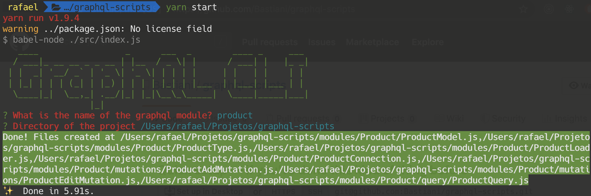

### GraphQL Scripts is a CLI command line for create modules with "Model, Type, Loader, Mutations and Query"

```bash
yarn global add @babel/core @babel/node
```

First and one time execute

```bash
npm link
```

```bash
graphql-module
```


